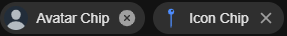

# Chip.vue
Es un elemento visual pequeño y redondeado que muestra información breve, como etiquetas o categorías, permitiendo también la opción de cerrarse o activarse.

## Components
```js
<template>
    <ion-chip>
      <ion-avatar>
        
      </ion-avatar>
      <ion-label>Avatar Chip</ion-label>
      <ion-icon :icon="closeCircle"></ion-icon>
    </ion-chip>
  
    <ion-chip>
      <ion-icon :icon="pin" color="primary"></ion-icon>
      <ion-label>Icon Chip</ion-label>
      <ion-icon :icon="close"></ion-icon>
    </ion-chip>
  </template>
  
  <script lang="ts">
    import { IonChip, IonAvatar, IonLabel, IonIcon } from '@ionic/vue';
    import { close, closeCircle, pin } from 'ionicons/icons';
    import { defineComponent } from 'vue';
  
    export default defineComponent({
      components: { IonChip, IonAvatar, IonLabel, IonIcon },
      setup() {
        return {
          close,
          closeCircle,
          pin,
        };
      },
    });
  </script>
  
```


## HomePage.vue
```js
<template>
  <ion-page>
    <ion-header :translucent="true">
      <ion-toolbar>
        <ion-title>Blank</ion-title>
      </ion-toolbar>
    </ion-header>

    <ion-content :fullscreen="true">
      <ion-header collapse="condense">
        <ion-toolbar>
          <ion-title size="large">Blank</ion-title>
        </ion-toolbar>
      </ion-header>

      <div id="container">
        <strong>Ready to create an app?</strong>
        <p>Start with Ionic <a target="_blank" rel="noopener noreferrer" href="https://ionicframework.com/docs/components">UI Components</a></p>
      </div>

      <Button></Button>
      <Card></Card>
      <Input></Input>
      <Radio></Radio>
      <Badge></Badge>
      <Date></Date>
      <Select></Select>
      <Checkbox></Checkbox>
      <Chip></Chip>
      <Action></Action>

    </ion-content>
  </ion-page>
</template>

<script setup lang="ts">
import { IonContent, IonHeader, IonPage, IonTitle, IonToolbar } from '@ionic/vue';
import Button from '@/components/Button.vue';
import Badge from '@/components/Badge.vue';
import Action from '@/components/Action.vue';
import Card from '@/components/Card.vue';
import Checkbox from '@/components/Checkbox.vue';
import Chip from '@/components/Chip.vue';
import Date from '@/components/Date.vue';
import Input from '@/components/Input.vue';
import Radio from '@/components/Radio.vue';
import Select from '@/components/Select.vue';
</script>

<style scoped>
#container {
  text-align: center;
  
  position: absolute;
  left: 0;
  right: 0;
  top: 50%;
  transform: translateY(-50%);
}

#container strong {
  font-size: 20px;
  line-height: 26px;
}

#container p {
  font-size: 16px;
  line-height: 22px;
  
  color: #8c8c8c;
  
  margin: 0;
}

#container a {
  text-decoration: none;
}
</style>

```

## Evidencia
