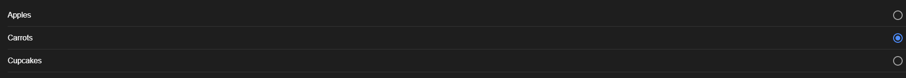

# Radio.vue
Es un botón de opción que permite al usuario seleccionar una única opción de un conjunto de opciones mutuamente excluyentes.

## Components
```js
<template>
    <ion-list>
      <ion-radio-group :compareWith="compareWith" @ionChange="handleChange($event)">
        <ion-item v-for="food in foods">
          <ion-radio :value="food">{{ food.name }}</ion-radio>
        </ion-item>
      </ion-radio-group>
    </ion-list>
  </template>
  
  <script lang="ts">
    import { IonItem, IonList, IonRadio, IonRadioGroup } from '@ionic/vue';
    import { defineComponent } from 'vue';
  
    export default defineComponent({
      components: {
        IonItem,
        IonList,
        IonRadio,
        IonRadioGroup,
      },
      data() {
        return {
          foods: [
            {
              id: 1,
              name: 'Apples',
              type: 'fruit',
            },
            {
              id: 2,
              name: 'Carrots',
              type: 'vegetable',
            },
            {
              id: 3,
              name: 'Cupcakes',
              type: 'dessert',
            },
          ],
        };
      },
      methods: {
        compareWith(o1, o2) {
          return o1.id === o2.id;
        },
        handleChange(ev) {
          console.log('Current value:', JSON.stringify(ev.detail.value));
        },
      },
    });
  </script>
  
```


## HomePage.vue
```js
<template>
  <ion-page>
    <ion-header :translucent="true">
      <ion-toolbar>
        <ion-title>Blank</ion-title>
      </ion-toolbar>
    </ion-header>

    <ion-content :fullscreen="true">
      <ion-header collapse="condense">
        <ion-toolbar>
          <ion-title size="large">Blank</ion-title>
        </ion-toolbar>
      </ion-header>

      <div id="container">
        <strong>Ready to create an app?</strong>
        <p>Start with Ionic <a target="_blank" rel="noopener noreferrer" href="https://ionicframework.com/docs/components">UI Components</a></p>
      </div>

      <Button></Button>
      <Card></Card>
      <Input></Input>
      <Radio></Radio>
      <Badge></Badge>
      <Date></Date>
      <Select></Select>
      <Checkbox></Checkbox>
      <Chip></Chip>
      <Action></Action>

    </ion-content>
  </ion-page>
</template>

<script setup lang="ts">
import { IonContent, IonHeader, IonPage, IonTitle, IonToolbar } from '@ionic/vue';
import Button from '@/components/Button.vue';
import Badge from '@/components/Badge.vue';
import Action from '@/components/Action.vue';
import Card from '@/components/Card.vue';
import Checkbox from '@/components/Checkbox.vue';
import Chip from '@/components/Chip.vue';
import Date from '@/components/Date.vue';
import Input from '@/components/Input.vue';
import Radio from '@/components/Radio.vue';
import Select from '@/components/Select.vue';
</script>

<style scoped>
#container {
  text-align: center;
  
  position: absolute;
  left: 0;
  right: 0;
  top: 50%;
  transform: translateY(-50%);
}

#container strong {
  font-size: 20px;
  line-height: 26px;
}

#container p {
  font-size: 16px;
  line-height: 22px;
  
  color: #8c8c8c;
  
  margin: 0;
}

#container a {
  text-decoration: none;
}
</style>

```

## Evidencia
