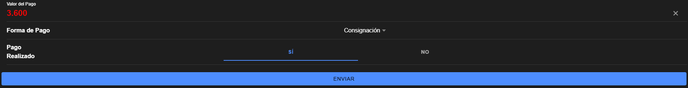

# FormaPago.vue

## Descripción y Propósito
El componente **FormaPago.vue** se encarga de manejar todo lo relacionado con la gestión del método de pago y la confirmación de que el pago ha sido efectuado. Este componente es clave para garantizar que el proceso de transacción sea sencillo y libre de errores, proporcionando al usuario opciones claras para completar su pago.

## Características Principales
- **Selección de Forma de Pago**: El componente incluye un menú desplegable que permite al usuario elegir el método de pago que prefiera. Las opciones disponibles son:
  - **Efectivo**: Permite que el usuario realice el pago con dinero en efectivo.
  - **Tarjeta de Crédito**: Opción para pagos mediante tarjeta de crédito.
  - **Tarjeta de Débito**: Permite el uso de una tarjeta de débito como método de pago.
  - **Consignación**: Opción para pagos realizados a través de consignaciones bancarias.
- **Confirmación de Pago**: Integra un segmento de opciones para que el usuario confirme si el pago ha sido realizado. Esto se muestra con las opciones "Sí" y "No", proporcionando una manera rápida y efectiva de registrar la confirmación.
- **Interfaz Amigable y Accesible**: Se ha diseñado para ser fácilmente comprensible, con etiquetas claras y elementos de selección intuitivos, garantizando una experiencia de usuario sin fricciones.

## Importancia y Beneficios
- **Eficiencia en la Gestión de Pagos**: La confirmación inmediata del estado del pago ayuda a los administradores del parqueadero a llevar un registro preciso y actualizado de las transacciones.
- **Flexibilidad en las Opciones de Pago**: Ofrecer múltiples métodos de pago es esencial para adaptarse a las necesidades de diversos clientes, mejorando la accesibilidad y la satisfacción del usuario.
- **Reducción de Errores**: La segmentación clara para la confirmación de pago reduce las posibilidades de errores humanos y facilita la validación de los datos ingresados.

## Components
```js
<template>
    <div>
      <!-- Forma de pago -->
      <ion-item class="input-item">
        <ion-label>Forma de Pago</ion-label>
        <ion-select v-model="formData.formaPago" ok-text="Aceptar" cancel-text="Cancelar">
          <ion-select-option value="efectivo">Efectivo</ion-select-option>
          <ion-select-option value="tarjeta_credito">Tarjeta de Crédito</ion-select-option>
          <ion-select-option value="tarjeta_debito">Tarjeta de Débito</ion-select-option>
          <ion-select-option value="consignacion">Consignación</ion-select-option>
        </ion-select>
      </ion-item>
  
      <!-- Pago realizado -->
      <ion-item class="input-item">
        <ion-label>Pago Realizado</ion-label>
        <ion-segment v-model="formData.pagoRealizado">
          <ion-segment-button value="si">
            <ion-label>Sí</ion-label>
          </ion-segment-button>
          <ion-segment-button value="no">
            <ion-label>No</ion-label>
          </ion-segment-button>
        </ion-segment>
      </ion-item>
    </div>
  </template>
  
  <script>
  export default {
    props: ['formData']
  };
  </script>

  <style scoped>
  
    ion-label {
      font-size: 22px;
      color: #000;
      font-weight: bold;
    }
    </style>
  
```


## HomePage.vue
```js
<template>
  <ion-page>
    <ion-header>
      <ion-toolbar>
        <ion-title>PARKING</ion-title>
      </ion-toolbar>
    </ion-header>

    <ion-content :fullscreen="true" class="content-padding">
      <ion-card class="form-card">
        <ion-card-header>
          <ion-card-title class="title">FORMULARIO DE PARQUEADERO</ion-card-title>
        </ion-card-header>

        <ion-card-content>
          <PlacaVehiculo :formData="formData" />
          <HorasPago :formData="formData" />
          <FormaPago :formData="formData" />

        
          <!-- Botón de Envío -->
          <ion-button expand="block" @click="handleSubmit" class="submit-button">
            Enviar
          </ion-button>
        </ion-card-content>
      </ion-card>
    </ion-content>
  </ion-page>
</template>

<script>
import PlacaVehiculo from '@/components/PlacaVehiculo.vue';
import HorasPago from '@/components/HorasPago.vue';
import FormaPago from '@/components/FormaPago.vue';

export default {
  name: 'HomePage',
  components: {
    PlacaVehiculo,
    HorasPago,
    FormaPago
  },
  data() {
    return {
      formData: {
        numeroPlaca: '',
        tipoVehiculo: '',
        numeroParqueadero: '',
        horaEntrada: '',
        horaSalida: '',
        valorPago: '',
        formaPago: '',
        pagoRealizado: ''
      }
    }
  },
  methods: {
    handleSubmit() {
      console.log('Formulario enviado:', this.formData);
      alert('Formulario de registro de parqueadero enviado correctamente.');
    }
  }
}
</script>

<style scoped>
.title {
  font-size: 30px;
  font-weight: bold;
  text-align: center;
  text-transform: uppercase;
}

.form-card {
  margin: 16px;
  padding-bottom: 30px;
}

.content-padding {
  padding-bottom: 40px;
}

.input-item {
  margin-bottom: 20px;
}

.datetime-center {
  display: block;
  margin: 0 auto;
}

ion-label {
  font-size: 22px;
  color: #000;
  font-weight: bold;
}

.submit-button {
  margin-top: 20px;
}
</style>


```

## Evidencia

