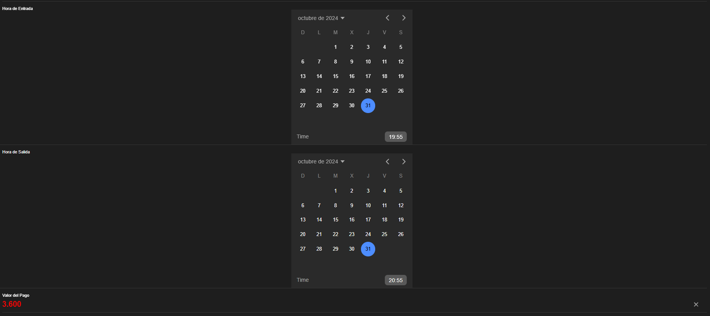

# HorasPago.vue

## Descripción y Propósito
El componente **HorasPago.vue** es responsable de registrar con precisión la hora de entrada y la hora de salida de los vehículos, así como de calcular automáticamente el valor del pago en función del tiempo transcurrido. Este componente es fundamental para el buen funcionamiento del parqueadero, ya que el tiempo de estacionamiento es un factor clave en la determinación del costo.

## Características Principales
- **Selectores de Hora de Entrada y Salida**: Utiliza `ion-datetime` para que los usuarios puedan seleccionar la hora exacta de entrada y salida. Estos selectores son intuitivos y aseguran que los datos sean precisos, lo cual es crucial para el cálculo del tiempo de estacionamiento.
- **Manejo de Validaciones**: El componente incluye validaciones para asegurarse de que las horas ingresadas sean correctas y de que no se produzcan errores en el cálculo del pago. Por ejemplo, verifica que la hora de salida sea posterior a la hora de entrada.
- **Interfaz Clara y Organizada**: Los campos están organizados de manera que sea fácil para el usuario comprender y completar la información requerida.

## Importancia y Beneficios
- **Precisión en el Cálculo del Pago**: Automatizar el cálculo del pago minimiza el riesgo de errores y acelera el proceso de cobro, beneficiando tanto a los administradores del parqueadero como a los clientes.
- **Optimización del Tiempo de Registro**: El uso de selectores de hora facilita el ingreso de datos y mejora la eficiencia del sistema.
- **Manejo de Datos en Tiempo Real**: Las validaciones aseguran que los datos sean precisos, lo que es fundamental para la operatividad y la administración del parqueadero.


## Components
```js
<template>
    <div>
      <!-- Hora de entrada -->
      <ion-item class="input-item">
        <ion-label position="stacked">Hora de Entrada</ion-label>
        <ion-datetime
          v-model="formData.horaEntrada"
          display-format="HH:mm"
          picker-format="HH:mm"
          class="datetime-center"
        ></ion-datetime>
      </ion-item>
  
      <!-- Hora de salida -->
      <ion-item class="input-item">
        <ion-label position="stacked">Hora de Salida</ion-label>
        <ion-datetime
          v-model="formData.horaSalida"
          display-format="HH:mm"
          picker-format="HH:mm"
          class="datetime-center"
        ></ion-datetime>
      </ion-item>
  
      <!-- Valor del Pago -->
      <ion-item class="input-item">
        <ion-label position="stacked">Valor del Pago</ion-label>
        <ion-input v-model="formData.valorPago" type="number" clear-input></ion-input>
      </ion-item>
    </div>
  </template>
  
  <script>
  export default {
    props: ['formData']
  };
  </script>

<style scoped>
  .datetime-center {
    display: block;
    margin: 0 auto;
  }
  ion-input {
      font-size: 22px;
      color: #f70404;
      font-weight: bold;
    }
  </style>
  
```


## HomePage.vue
```js
<template>
  <ion-page>
    <ion-header>
      <ion-toolbar>
        <ion-title>PARKING</ion-title>
      </ion-toolbar>
    </ion-header>

    <ion-content :fullscreen="true" class="content-padding">
      <ion-card class="form-card">
        <ion-card-header>
          <ion-card-title class="title">FORMULARIO DE PARQUEADERO</ion-card-title>
        </ion-card-header>

        <ion-card-content>
          <PlacaVehiculo :formData="formData" />
          <HorasPago :formData="formData" />
          <FormaPago :formData="formData" />

        
          <!-- Botón de Envío -->
          <ion-button expand="block" @click="handleSubmit" class="submit-button">
            Enviar
          </ion-button>
        </ion-card-content>
      </ion-card>
    </ion-content>
  </ion-page>
</template>

<script>
import PlacaVehiculo from '@/components/PlacaVehiculo.vue';
import HorasPago from '@/components/HorasPago.vue';
import FormaPago from '@/components/FormaPago.vue';

export default {
  name: 'HomePage',
  components: {
    PlacaVehiculo,
    HorasPago,
    FormaPago
  },
  data() {
    return {
      formData: {
        numeroPlaca: '',
        tipoVehiculo: '',
        numeroParqueadero: '',
        horaEntrada: '',
        horaSalida: '',
        valorPago: '',
        formaPago: '',
        pagoRealizado: ''
      }
    }
  },
  methods: {
    handleSubmit() {
      console.log('Formulario enviado:', this.formData);
      alert('Formulario de registro de parqueadero enviado correctamente.');
    }
  }
}
</script>

<style scoped>
.title {
  font-size: 30px;
  font-weight: bold;
  text-align: center;
  text-transform: uppercase;
}

.form-card {
  margin: 16px;
  padding-bottom: 30px;
}

.content-padding {
  padding-bottom: 40px;
}

.input-item {
  margin-bottom: 20px;
}

.datetime-center {
  display: block;
  margin: 0 auto;
}

ion-label {
  font-size: 22px;
  color: #000;
  font-weight: bold;
}

.submit-button {
  margin-top: 20px;
}
</style>


```

## Evidencia

