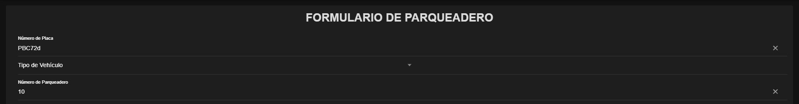

# PlacaVehiculo.vue

## Descripción y Propósito
El componente **PlacaVehiculo.vue** gestiona la entrada de la información básica del vehículo, incluyendo el número de placa, el tipo de vehículo y el número de parqueadero asignado. Este componente juega un papel esencial en la organización y el control de los vehículos dentro del parqueadero.

## Características Principales
- **Campo de Número de Placa**: Proporciona un campo de entrada para que el usuario pueda ingresar el número de placa del vehículo. Esta información es fundamental para la identificación y el seguimiento del vehículo en el sistema.
- **Selección del Tipo de Vehículo**: Incluye un menú desplegable que permite seleccionar el tipo de vehículo. Las opciones disponibles son:
  - **Automóvil**
  - **Moto**
  - **Camioneta**
  - **Otro**
- **Asignación de Número de Parqueadero**: Permite asignar un número específico de parqueadero al vehículo, lo que facilita la organización y el control del espacio disponible. Este campo es crucial para una gestión eficiente del estacionamiento.
- **Validación de Datos**: Implementa validaciones para asegurar que la información ingresada sea precisa y esté completa antes de permitir el envío del formulario.

## Importancia y Beneficios
- **Organización y Control**: La entrada de datos precisa y la categorización de los vehículos ayudan a optimizar el uso del espacio en el parqueadero y a mantener un registro ordenado.
- **Facilidad de Uso**: La interfaz del componente está diseñada para ser fácil de entender y usar, lo que mejora la experiencia del usuario.
- **Flexibilidad**: La capacidad de seleccionar diferentes tipos de vehículos y asignarles números de parqueadero específicos proporciona flexibilidad y facilita la gestión de diferentes tipos de usuarios y vehículos.

## Components
```js
<template>
    <div>
      <!-- Número de placa -->
      <ion-item class="input-item">
        <ion-label position="stacked">Número de Placa</ion-label>
        <ion-input v-model="formData.numeroPlaca" clear-input></ion-input>
      </ion-item>
  
      <!-- Tipo de vehículo -->
      <ion-item class="input-item">
        <ion-label>Tipo de Vehículo</ion-label>
        <ion-select v-model="formData.tipoVehiculo" ok-text="Aceptar" cancel-text="Cancelar">
          <ion-select-option value="automóvil">Automóvil</ion-select-option>
          <ion-select-option value="moto">Moto</ion-select-option>
          <ion-select-option value="camioneta">Camioneta</ion-select-option>
          <ion-select-option value="otro">Otro</ion-select-option>
        </ion-select>
      </ion-item>
  
      <!-- Número de parqueadero -->
      <ion-item class="input-item">
        <ion-label position="stacked">Número de Parqueadero</ion-label>
        <ion-input v-model="formData.numeroParqueadero" type="number" clear-input></ion-input>
      </ion-item>
    </div>
  </template>
  
  <script>
  export default {
    props: ['formData']
  };
  </script>
  
  
```


## HomePage.vue
```js
<template>
  <ion-page>
    <ion-header>
      <ion-toolbar>
        <ion-title>PARKING</ion-title>
      </ion-toolbar>
    </ion-header>

    <ion-content :fullscreen="true" class="content-padding">
      <ion-card class="form-card">
        <ion-card-header>
          <ion-card-title class="title">FORMULARIO DE PARQUEADERO</ion-card-title>
        </ion-card-header>

        <ion-card-content>
          <PlacaVehiculo :formData="formData" />
          <HorasPago :formData="formData" />
          <FormaPago :formData="formData" />

        
          <!-- Botón de Envío -->
          <ion-button expand="block" @click="handleSubmit" class="submit-button">
            Enviar
          </ion-button>
        </ion-card-content>
      </ion-card>
    </ion-content>
  </ion-page>
</template>

<script>
import PlacaVehiculo from '@/components/PlacaVehiculo.vue';
import HorasPago from '@/components/HorasPago.vue';
import FormaPago from '@/components/FormaPago.vue';

export default {
  name: 'HomePage',
  components: {
    PlacaVehiculo,
    HorasPago,
    FormaPago
  },
  data() {
    return {
      formData: {
        numeroPlaca: '',
        tipoVehiculo: '',
        numeroParqueadero: '',
        horaEntrada: '',
        horaSalida: '',
        valorPago: '',
        formaPago: '',
        pagoRealizado: ''
      }
    }
  },
  methods: {
    handleSubmit() {
      console.log('Formulario enviado:', this.formData);
      alert('Formulario de registro de parqueadero enviado correctamente.');
    }
  }
}
</script>

<style scoped>
.title {
  font-size: 30px;
  font-weight: bold;
  text-align: center;
  text-transform: uppercase;
}

.form-card {
  margin: 16px;
  padding-bottom: 30px;
}

.content-padding {
  padding-bottom: 40px;
}

.input-item {
  margin-bottom: 20px;
}

.datetime-center {
  display: block;
  margin: 0 auto;
}

ion-label {
  font-size: 22px;
  color: #000;
  font-weight: bold;
}

.submit-button {
  margin-top: 20px;
}
</style>


```

## Evidencia

