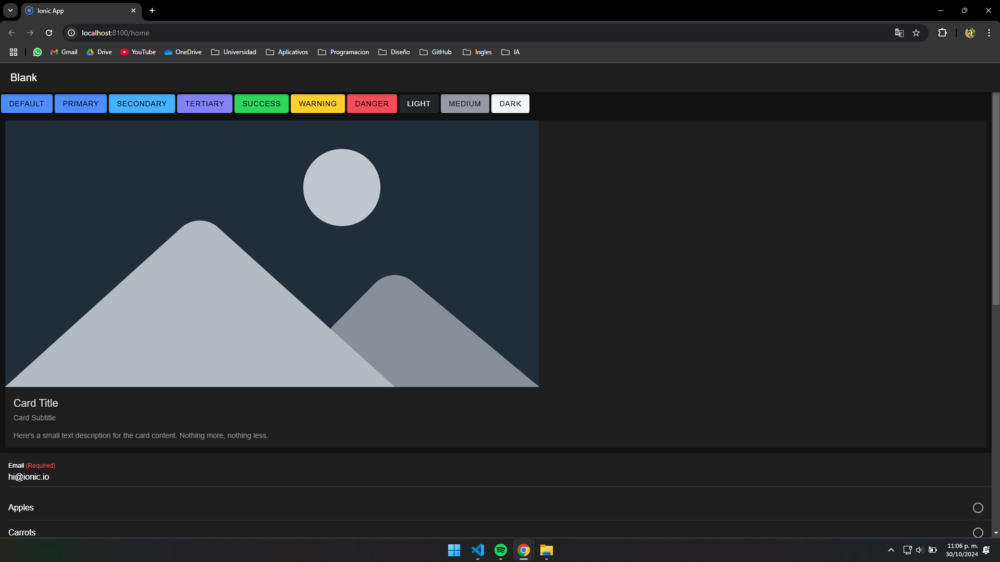
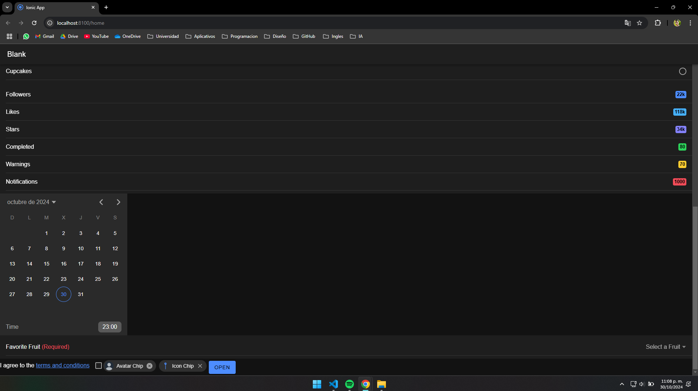
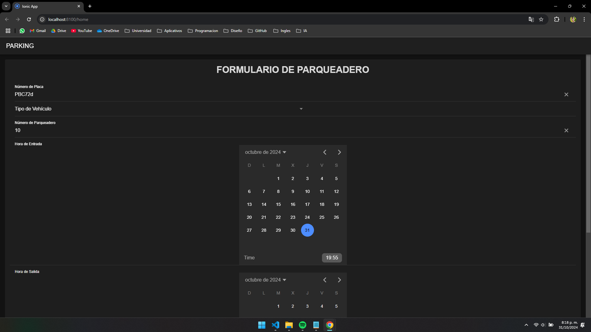
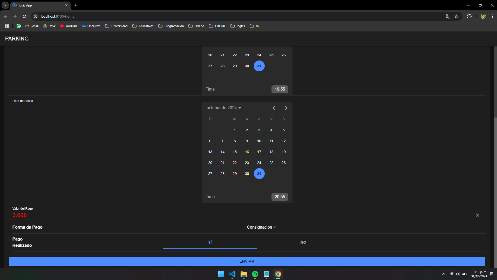

# Construcción de Componentes
Esta documentación se centra en la creación de componentes utilizando Ionic Vue, abordando el desarrollo y la integración de elementos clave. La primera parte se enfocará en la creación de 10 componentes individuales, explicando el propósito y funcionalidad de cada uno. En la segunda parte, se presentarán tres componentes más complejos que combinarán varios elementos para demostrar su integración y funcionamiento.

## Pasos Iniciales

Este documento proporciona una guía paso a paso para crear la aplicación wed desde cero utilizando **Vue 3** e **Ionic Framework**.

### Requisitos Previos

Antes de comenzar, asegúrate de tener lo siguiente instalado en tu sistema:

- **Node.js** (versión 14 o superior): [Descargar Node.js](https://nodejs.org/)
- **NPM** (gestor de paquetes de Node): Generalmente, se instala junto con Node.js.
- **Vue CLI**: Instala la herramienta de línea de comandos de Vue.
  ```bash
  npm install -g @vue/cli

### Instalación del Proyecto

Sigue estos pasos para clonar e instalar el proyecto:

1. **Clona el repositorio:**

    ```bash
    git clone https://github.com/Temenico/programacion-movil-c3-q2
    cd programacion-movil-c3-q2
    ```
    

2. **Instala las dependencias:**

    ```bash
    npm install -g @ionic/cli
    ```

### Ejecución del Proyecto

Para ejecutar el proyecto en un servidor local de desarrollo, utiliza:

1. **Ingresa a la ruta dependiendo del proyecto a ejecutar:**

    *Primera Parte*
    ```bash
    cd Ionic-One
    ```
    *Segunda Parte*
    ```bash
    cd Ionic-Crud
    ```
    

2. **Ejecuta el Proyecto:**

    ```bash
    ionic serve
    ```

3. **Instala el vite con `Y`:**

    ```bash
    ? Install vite? (Y/n)
    ```

---
# Primera Parte
La primera parte de esta documentación se centrará en la creación de 10 componentes individuales utilizando Ionic Vue. Estos componentes representarán elementos básicos de una interfaz de usuario, como campos de entrada (Input), botones (Button), y tarjetas (Card). Cada componente se diseñará para cumplir una funcionalidad específica y proporcionar una base sólida para la construcción de interfaces más complejas en futuras secciones. La intención es familiarizarse con la estructura y el comportamiento de los componentes en Ionic Vue, estableciendo una comprensión clara de su propósito y cómo se integran en la aplicación.

A continuación se mostrara los 10 componentes utilizados en el trabajo:
* [**Action.vue**](FuncionPrimeraParte/Action.md)
* [**Badge.vue**](FuncionPrimeraParte/Badge.md)
* [**Button.vue**](FuncionPrimeraParte/Button.md)
* [**Card.vue**](FuncionPrimeraParte/Card.md)
* [**Checkbox.vue**](FuncionPrimeraParte/Checkbox.md)
* [**Chip.vue**](FuncionPrimeraParte/Chip.md)
* [**Date.vue**](FuncionPrimeraParte/Date.md)
* [**Input.vue**](FuncionPrimeraParte/Input.md)
* [**Radio.vue**](FuncionPrimeraParte/Radio.md)
* [**Select.vue**](FuncionPrimeraParte/Select.md)





---
# Segunda Parte 
La segunda parte de esta guía se enfocará en crear tres componentes más completos usando Ionic Vue. Aquí se integrarán varios elementos en una sola pantalla. El ejemplo principal será un sistema de parqueadero, que permitirá gestionar y registrar la información de vehículos que ingresan y salen de un parqueadero. La idea es mostrar cómo unir los componentes básicos para hacer una aplicación más útil y práctica.




## [Gestión de Parqueadero](Ionic-Crud/src/views/HomePage.vue)
**Gestión de Parqueadero** es una aplicación desarrollada con Vue.js e Ionic Framework que permite registrar y gestionar la información de vehículos que ingresan y salen de un parqueadero. La aplicación está organizada en varios componentes para facilitar su mantenimiento y extensión. Aquí se describe brevemente la estructura y las funcionalidades principales de este proyecto.

### Características Principales

1. **Formulario de Registro de Vehículos**:
   - La aplicación proporciona un formulario intuitivo para registrar los datos de los vehículos, como el número de placa, el tipo de vehículo y el número de parqueadero asignado.
   - Se ofrece un menú desplegable para seleccionar el tipo de vehículo, con opciones como automóvil, moto, camioneta u otro tipo.

2. **Registro de Horas**:
   - Permite ingresar la hora de entrada y la hora de salida del vehículo mediante un selector de tiempo que es fácil de usar.
   - El diseño asegura que los campos de hora sean claros y accesibles para el usuario.

3. **Cálculo del Pago**:
   - Incluye un campo para ingresar o calcular el valor del pago basado en las horas de estacionamiento.
   - Se proporciona un selector para la forma de pago, que admite métodos como efectivo, tarjeta de crédito, tarjeta de débito o consignación.

4. **Confirmación de Pago Realizado**:
   - El usuario puede seleccionar si el pago ha sido realizado mediante una opción de segmentación que muestra claramente "Sí" o "No".

5. **Interfaz de Usuario Intuitiva**:
   - La interfaz es moderna y está diseñada para ser fácil de usar, con etiquetas claras y un diseño responsivo.
   - El botón de envío está estratégicamente ubicado para garantizar que el usuario pueda completar y enviar el formulario sin problemas.

## **Organización en Componentes** ##
Este proyecto se ha estructurado en tres componentes principales para organizar y simplificar la gestión de la información. A continuación, se describe brevemente cada uno de ellos:

### [FormaPago.vue](FuncionSegundaParte/FormaPago.md)
- **Propósito**: Este componente gestiona todo lo relacionado con la forma de pago y la confirmación del pago realizado.

### [HorasPago.vue](FuncionSegundaParte/HorasPago.md)
- **Propósito**: Este componente maneja la entrada y salida de horas, así como el cálculo del valor del pago.

### [PlacaVehiculo.vue](FuncionSegundaParte/PlacaVehiculo.md)
- **Propósito**: Este componente se encarga de capturar la información básica del vehículo.
Estos componentes permiten dividir la lógica y el diseño de la aplicación de manera organizada y modular, facilitando su mantenimiento y expansión.

## Objetivo del Proyecto
El objetivo principal de este proyecto es facilitar la gestión de la información de vehículos en un parqueadero, optimizando el registro de entrada y salida y mejorando el proceso de cobro y confirmación de pagos. La aplicación puede ser utilizada en pequeños y grandes parqueaderos, adaptándose a las necesidades del usuario.
